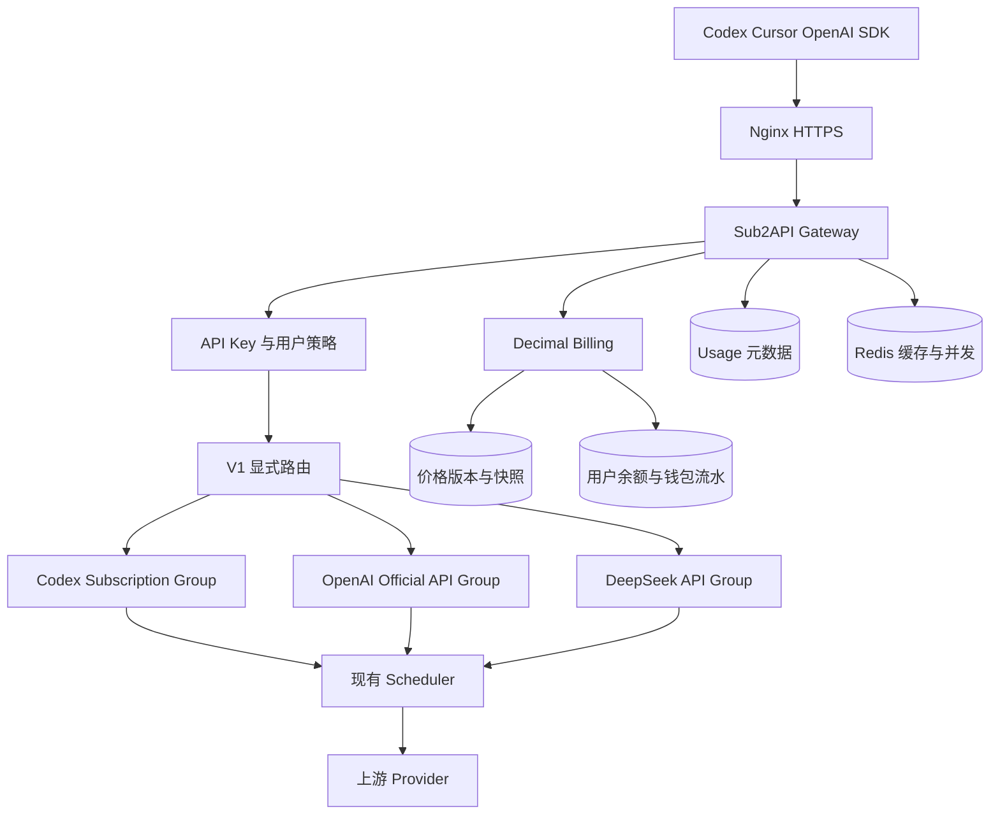
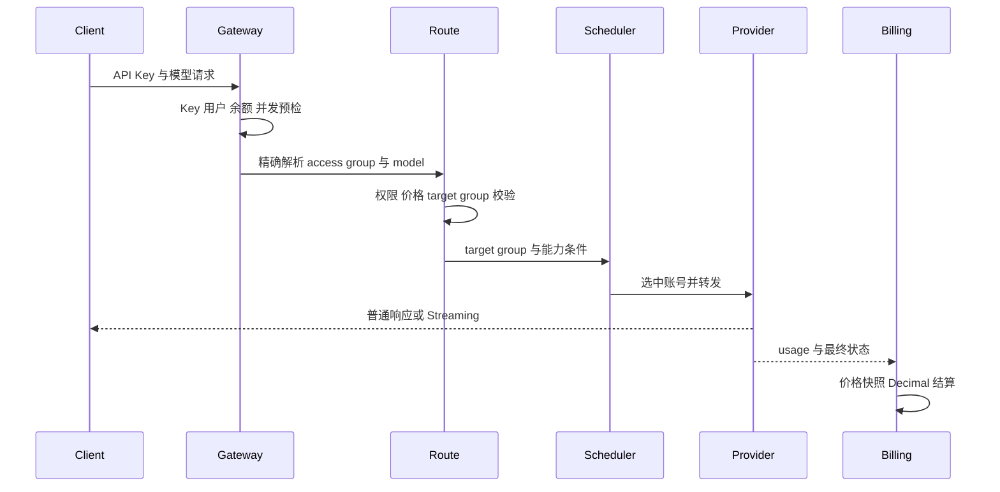
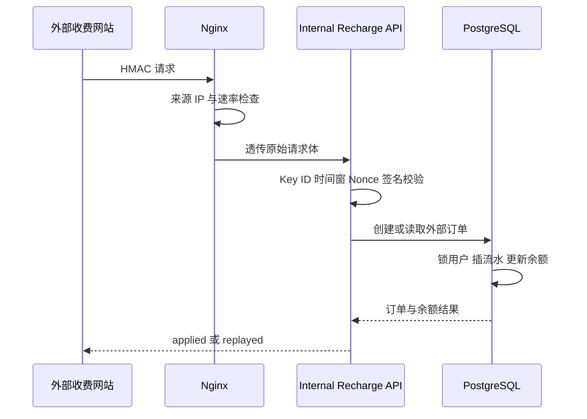
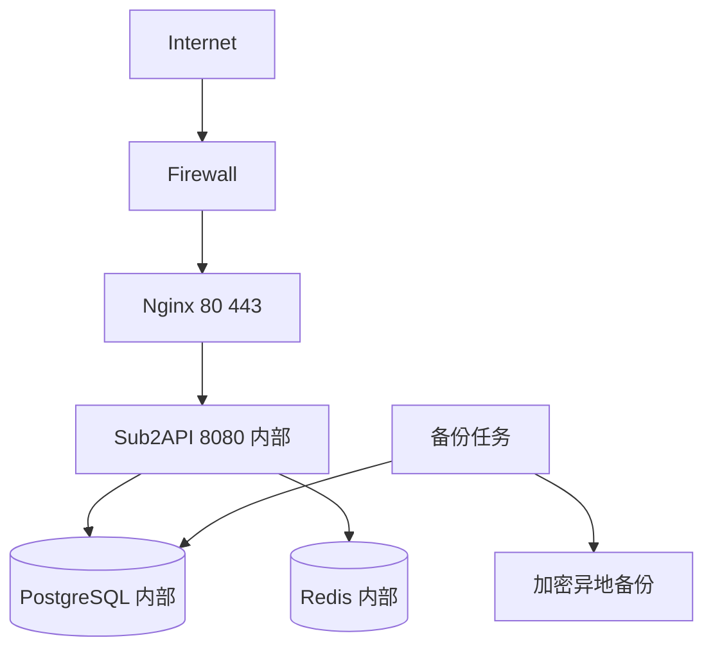

# 系统架构设计

## 1. 结论

Sub2API 适合作为 V1 底座。它已经具备完整 Gateway、OpenAI OAuth、Responses、Chat Completions、Streaming、多账号调度、Sticky Session、并发控制、余额预检、usage 扣费、管理后台、PostgreSQL、Redis 和 Compose 部署能力。

V1 应保持这些核心模块，新增一层小规模站点策略、目标 Group 锁定、模型权限、Decimal 账本和版本化价格。最大的架构改动位于路由决策与结算边界，范围应受到专门测试保护。

## 2. 源码基线

| 项目 | 结论 | 主要路径 |
| --- | --- | --- |
| Backend | Go、Gin、Wire、Ent、PostgreSQL、Redis | `backend/cmd/server/main.go`、`backend/internal/server`、`backend/internal/service/wire.go` |
| Frontend | Vue 3、TypeScript、Vite、Pinia | `frontend/src`、`frontend/package.json` |
| Gateway 路由 | Anthropic、OpenAI、Responses、Chat Completions、Gemini 等 | `backend/internal/server/routes/gateway.go` |
| OpenAI 调度 | OAuth 与 API Key 账号、多层筛选、Sticky、previous response | `backend/internal/service/openai_account_scheduler.go` |
| 通用调度 | Group、账号权重、并发、会话缓存 | `backend/internal/service/gateway_service.go` |
| Redis | API Key 缓存、会话绑定、并发槽位、限流、调度快照 | `backend/internal/repository/gateway_cache.go` 及 Redis repository |
| Billing | 模型价格解析、usage 成本、事务扣款去重 | `backend/internal/service/billing_service.go`、`model_pricing_resolver.go`、`gateway_usage_billing.go`、`backend/internal/repository/usage_billing_repo.go` |
| 数据模型 | Ent schema 加 SQL migrations | `backend/ent/schema`、`backend/migrations` |
| 管理面 | Admin routes、审计、前端管理页面 | `backend/internal/server/routes/admin.go`、`frontend/src/views/admin` |
| 部署 | Docker Compose、Caddy 示例、边缘安全说明 | `deploy/docker-compose.yml`、`deploy/docker-compose.local.yml`、`deploy/EDGE_SECURITY.md` |

## 3. 原始请求架构

客户端请求先经过 API Key middleware。认证快照包含用户、Key、Group、余额、并发和权限信息。Gateway Handler 解析模型与协议，Scheduler 从 Group 账号池选择账号，Provider 转发请求并处理 Streaming。响应结束后解析 usage，Billing 计算费用，Repository 使用 PostgreSQL 事务扣减余额和相关配额，再异步或同步写 usage log。

现有关键事实：

1. API Key 通常绑定一个 Group，未绑定 Group 的调度默认 fail closed，见 `backend/internal/server/middleware/middleware.go`。
2. Composite Group 可以按模型选择具体平台，见 `backend/internal/service/composite_model_route.go` 和 `composite_platform.go`。
3. 当前 Composite Route 只记录 `target_platform`，不能锁定另一个目标 Group。
4. Codex Subscription 与 OpenAI Official API 的账号平台都为 `openai`，只按平台无法保证成本池隔离。
5. Group 已有 fallback 字段，V1 必须保持为空。
6. 当前 usage billing 有 `(request_id, api_key_id)` 去重表和事务扣款，但 usage log 写入与扣款并非同一事务。

## 4. V1 目标架构

### 4.1 客户访问 Group

创建一个面向用户的 `V1 Gateway` Composite Group。用户 API Key 绑定该 Group，从而让一个 Key 可以访问经授权的三类模型。

对现有 Composite Group 做两个受控扩展：

1. `groups.composite_explicit_routes_only`：为 true 时，未命中显式路由立即返回 `MODEL_ROUTE_NOT_FOUND`，不执行内置模型前缀猜测。
2. `composite_model_routes.target_group_id`：显式锁定具体账号池。保存时校验目标 Group 存在、启用、平台与 `target_platform` 相同，且目标 Group 不能再次为 Composite。

路由决策需要区分：

* `access_group_id`：用户 Key 绑定的 V1 Gateway Group，用于访问授权。
* `target_group_id`：本次请求的实际账号池，用于 Scheduler、Provider 健康和目标组价格规则。
* `target_platform`：具体 Provider 协议。

所有三类路由均使用 exact match。Prefix match 暂不用于 V1 对外模型，降低误路由风险。

### 4.2 Provider 隔离

| Provider | 目标 Group | 账号类型 | 允许协议 | 自动跨组 |
| --- | --- | --- | --- | --- |
| Codex Subscription | `Codex Subscription Group` | OpenAI OAuth | Responses 为主，按实测开放 | 禁止 |
| OpenAI Official API | `OpenAI Official API Group` | OpenAI API Key | Responses、Chat Completions | 禁止 |
| DeepSeek Official API | `DeepSeek API Group` | DeepSeek API Key | Chat Completions | 禁止 |

每个目标 Group 独立启停、独立账号池、独立健康状态和独立价格。一个 Group 不可用时，只返回该 Provider 的稳定错误。

### 4.3 Scheduler 复用

继续使用 Sub2API 的现有 Scheduler。路由层只向 Scheduler 提供已经确定的 `target_group_id`、平台、逻辑模型和实际模型，不修改其账号评分算法。

继续复用：

1. 账号状态、`schedulable` 和临时不可调度时间。
2. 优先级、权重、并发槽位和排队。
3. 429、401、403、5xx 的账号状态处理。
4. OpenAI previous response 与 Session Sticky。
5. OAuth Token 刷新与失效处理。

管理页面可把现有状态映射成 Active、Cooldown、Exhausted、Disabled。映射只用于展示，不新增会改变调度语义的状态机。

### 4.4 用户模型权限

新增 `user_model_permissions`。请求在路由命中后、占用上游并发前检查当前用户是否有对应 route 权限。管理员可按逻辑模型授权。

默认策略：

1. 新用户无模型权限。
2. Admin 显式授权后生效。
3. 路由被停用时权限自动失效。
4. 权限查询可以缓存到 Redis，PostgreSQL 是权威来源。

M6.3 先采用 PostgreSQL 直接查询并 fail closed，不在缺少缓存时降级放行。管理员通过带强 ETag 的完整替换 API 更新权限集合，事务级 advisory lock 与版本比较阻止并发覆盖。Gateway 只把 Composite exact Route 视为可授权身份；detector/account ownership 的隐式结果不能绕过授权。模型目录使用相同权限来源，空权限返回空目录且不回退到静态模型。

## 5. 请求流

请求前检查顺序：

1. API Key 摘要认证。
2. Key 状态、有效期与 IP 规则。
3. User 状态。
4. V1 Gateway Group 状态。
5. 显式 route 命中与启用状态。
6. `user_model_permissions`。
7. 有效价格版本。
8. 余额大于零。
9. 用户与账号并发限制。
10. 目标 Group 可用账号。

## 6. Streaming 与 Sticky Session

Streaming 沿用现有转发路径。Nginx 必须关闭响应和请求缓冲，SSE 不启用 gzip，读写超时按最长 Codex 任务设置。请求开始后不再因余额变化中断响应，结束时按真实 usage 结算。

Sticky 继续复用：

* `backend/internal/service/openai_sticky_compat.go`
* `backend/internal/service/session_id.go`
* `backend/internal/repository/gateway_cache.go`
* `backend/internal/service/openai_account_scheduler.go`

需要在 M3 和 M11 实测客户端实际发送的会话标识。Nginx 应透传所有标准请求头，并重点核对 `X-Session-Id`、`X-Claude-Code-Session-Id`、Responses previous response 关联字段和 WebSocket Upgrade。

## 7. 计费与钱包架构

### 7.1 币种

V1 权威记账币种为 CNY。用户价格由管理员直接配置为人民币每百万 Token 或其他明确单位，不在请求热路径自动抓取汇率。

### 7.2 数据职责

| 数据 | 权威位置 | 说明 |
| --- | --- | --- |
| 当前余额 | `users.balance` | 复用现有热路径，值语义调整为 CNY |
| 不可变流水 | `wallet_transactions` | recharge、usage、refund、adjustment |
| 价格规则 | `model_pricing_rules` | 稳定业务标识与当前版本 |
| 价格版本 | `model_pricing_versions` | 不可变 Decimal 单价 |
| 请求账单 | `usage_logs` | Token、价格快照、最终 CNY 费用 |
| 外部充值订单 | `external_recharge_orders` | HMAC 请求、幂等状态、流水引用 |

不新增 `wallets` 表。现有 `users.balance` 已被认证和 Billing 热路径广泛使用，再增加一份余额会产生双写一致性问题。钱包概念由 `users.balance` 加 `wallet_transactions` 实现。

### 7.3 结算事务

目标结算事务包含：

1. 认领 `(request_id, api_key_id)` 幂等键。
2. 锁定用户余额行或执行可返回旧值与新值的原子更新。
3. 插入 usage log，保存价格版本和快照。
4. 插入唯一 `usage` 钱包流水。
5. 更新 `users.balance`。
6. 更新 Key 和账号统计。
7. 提交事务后失效相关缓存。

当前 `usage_billing_repo.Apply` 已提供事务和去重基础，应扩展该边界，减少新的结算协调器。

Streaming 非终止事件可以实时转发，但最终 `response.completed`、`[DONE]` 或等价终止事件必须等到结算事务提交，或故障恢复日志已可靠持久化后再发送。非流式响应也在同一完成屏障之后结束。

持续数据库故障发生在最终 usage 到达后时，Gateway 不能只依赖普通日志。V1 在独立持久卷维护带版本、checksum 和幂等 fingerprint 的结算恢复日志：数据库有限重试仍失败时，先写入并 fsync 不含 Prompt、Answer 和 Secret 的结算 envelope，再发送 Streaming 终止事件或结束非流式响应，同时写入 degraded sentinel 并拒绝新模型请求。启动时发现 sentinel 或未归档记录必须继续 fail closed。数据库恢复后按幂等键重放；全部记录落账并完成对账后，只能通过 Admin step up 人工解除。该路径需要 M12 做断电、损坏记录、重复重放和重启测试。

## 8. 充值流

充值不复用公开 Payment 页面。现有支付模块继续保留，但通过设置、路由守卫和前端策略关闭。

## 9. Admin 与 User Portal

Admin 复用现有 Users、Accounts、Groups、Usage、Settings、Dashboard 页面与 API，新增钱包流水、模型权限、目标 Group 路由、价格版本和外部充值配置。现有支付、套餐、优惠码、返利和多 Provider 商业页面保留源文件并关闭入口。

User Portal 只保留：

1. 我的余额与消费。
2. 我的 API Key。
3. 我的 usage 元数据。
4. 我的可用模型。
5. API Base URL。
6. Codex 和 Cursor 配置指南。

所有用户查询由 JWT Subject 强制注入 User ID，忽略客户端提交的其他用户 ID。

## 10. 部署拓扑

开发环境使用 Windows Docker Desktop 和 Compose。生产使用单台 Linux 云服务器起步，Nginx 终止 TLS，Sub2API、PostgreSQL 与 Redis 位于专用 Docker Network。

公网只开放 80、443 和受限 SSH。Backend 8080 绑定回环地址或只在 Compose 网络内可达。PostgreSQL 与 Redis 不发布宿主机端口。

## 11. 功能裁剪策略

| 功能 | V1 处理 | 依据 |
| --- | --- | --- |
| 公开注册 | 设置关闭，加服务端守卫，隐藏页面入口 | `registration_enabled` 已存在 |
| 在线支付 | `payment_enabled=false`，整组路由守卫，隐藏导航 | `backend/internal/server/routes/payment.go` |
| 优惠码与邀请码 | 设置关闭，接口守卫，隐藏入口 | `setting_features.go` |
| 邀请返利 | `affiliate_enabled=false` | 现有 feature flag |
| 第三方登录 | 全部 Provider 开关关闭 | Auth routes 仍保留 |
| Model Plaza | `model_plaza_enabled=false` | 现有 feature flag |
| Available Channels | `available_channels_enabled=false` | 现有 feature flag |
| Plugin Management | 关闭入口，运行时插件保持禁用 | 现有开关只控制 Sidebar，需要服务端策略 |
| Redeem | V1 隐藏并拒绝 User route | 后端能力保留 |

`backend_mode_enabled` 会阻止普通用户登录，因此不能作为 V1 整体裁剪开关。

## 12. 可恢复性与观测

PostgreSQL 保存正常运行时的业务真相。Redis 仅保存缓存、限流、并发和 Sticky。Redis 重启后允许缓存重建，不能改变账单和余额。PostgreSQL 故障窗口内尚未入账的最终 usage 只允许暂存在加密、校验并 fsync 的本地恢复日志中；它是受控故障缓冲，不是第二套账本，恢复后必须重放到 PostgreSQL 并归档。

严重故障包括：

1. Backend 或 PostgreSQL 不可用。
2. Redis 不可用导致认证、限流或调度 fail closed。
3. Billing degraded。
4. 全部 Codex、OpenAI 或 DeepSeek 目标账号不可用。
5. 五分钟 5xx 比例超过 5%。
6. 钱包对账差异不为零。
7. 备份失败或恢复校验失败。
8. Secret 泄漏或异常管理员操作。

V1 使用现有 Dashboard、Docker Healthcheck、结构化日志和管理员告警，不引入复杂监控集群。

## 13. 有意保留的边界

1. 不重写 Provider adapter。
2. 不重写 OpenAI OAuth、Token refresh、Streaming 和 Scheduler。
3. 不删除 upstream 支付与商业模块。
4. 不自动推导 Subscription 真实成本。
5. 不实现自动跨 Provider 智能路由。
6. 不在 V1 引入多币种钱包。
7. 不在 V1 建设 Prometheus 与 Grafana 集群。
