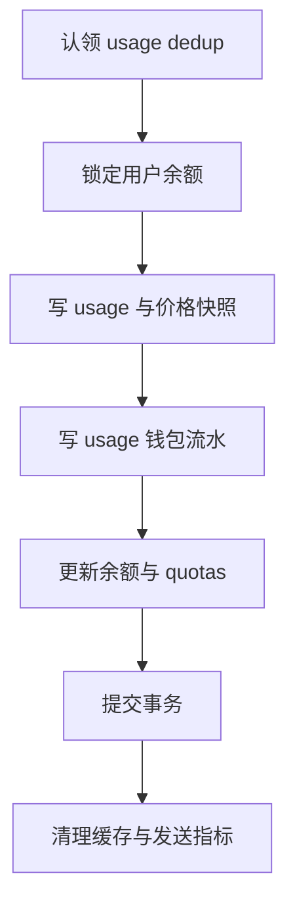

# 计费与钱包设计

## 1. 目标

V1 使用人民币预充值余额，请求完成后按真实 usage 扣费。价格可在 Admin 后台动态发布，历史请求保存当时的价格版本和单价快照。任何一个 usage、充值、退款或调账都能通过不可变钱包流水追溯。

## 2. 当前 Sub2API 能力

当前代码已经提供良好基础：

1. `backend/internal/service/billing_service.go` 处理 Token、Cache、图片、音频、搜索等成本。
2. `backend/internal/service/model_pricing_resolver.go` 支持 Group、Channel 与内置价格来源。
3. `backend/internal/service/gateway_usage_billing.go` 汇总 usage、费率倍率和 usage log。
4. `backend/internal/repository/usage_billing_repo.go` 在 PostgreSQL 事务中认领 dedup key，并更新余额、Key quota、订阅和账号 quota。
5. `backend/migrations/071_add_usage_billing_dedup.sql` 通过 `(request_id, api_key_id)` 防止重复扣款。
6. `backend/internal/server/middleware/api_key_auth.go` 在普通模型请求前拒绝 `balance <= 0`。
7. 当前扣款在余额不足时仍可记录负余额，符合 Streaming 完成后按真实费用结算的目标。

## 3. 已知缺口

1. Billing 与大部分金额 Service 使用 `float64`。
2. Billing Service 存在硬编码模型价格兜底。
3. Group 和 Channel 价格可以修改，但没有完整不可变历史。
4. usage log 保存成本分量和倍率，没有价格规则 ID、价格版本和完整单价快照。
5. 用户余额变更没有统一不可变总账。现有 Admin 历史主要借用 redeem code 和 affiliate ledger。
6. usage log 写入在账务事务之后以 best effort 执行，可能出现已扣款但日志缺失。
7. 现有字段和前端大量采用 USD 语义，用户目标为 CNY。

这些缺口使 M6 与 M7 成为生产试运行前的强制前置项。

## 4. 记账币种与数值类型

### 4.1 币种

V1 只使用 CNY。管理员直接配置 CNY 售价。上游 OpenAI 或 DeepSeek 的 USD 成本可以作为运营参考存入脱敏 metadata，不参与用户实时结算。

如现有数据库已经有余额和账单，币种切换必须人工确认汇率和生效时点。建议 V1 在全新数据库开始，避免同一列出现混合币种。

### 4.2 Decimal

* Go：`shopspring/decimal.Decimal`
* PostgreSQL 余额与费用：`NUMERIC(20,8)`
* 单价：`NUMERIC(24,12)`
* API：十进制字符串
* 最终费用：`ROUND_HALF_UP` 到 8 位小数

禁止在新账务路径中执行 Decimal 到 float 再到 NUMERIC 的往返。

## 5. 价格模型

### 5.1 规则和版本

`model_pricing_rules` 表示稳定规则，绑定 Provider、目标 Group、逻辑模型、协议、币种和 billing unit。`model_pricing_versions` 保存不可变单价与有效区间。

一个请求在开始上游调用前解析并冻结 `pricing_version_id`。响应结束时使用同一版本结算。请求执行期间管理员调价不会影响已开始的请求。

### 5.2 解析顺序

V1 只接受以下唯一精确匹配：

1. target Group ID
2. logical model
3. endpoint protocol，先精确协议，后 `any`
4. `enabled=true`
5. `effective_from <= request_started_at < effective_to`，空 effective to 表示持续有效

匹配到零条返回 `PRICE_NOT_CONFIGURED`。匹配到多条返回 `PRICE_AMBIGUOUS`，同时触发管理员告警。V1 收费路径禁止进入 `billing_service.go` 的硬编码兜底价格。

### 5.3 发布调价

一次发布在事务中完成：

1. 锁定 pricing rule。
2. 校验新版本单价与生效时间。
3. 将上一版本 `effective_to` 设置为新版本 `effective_from`。
4. 插入新版本。
5. 更新仅供管理面展示的 `latest_published_version_id`；运行时仍按 `request_started_at` 查询有效区间。
6. 写 Admin audit log。
7. 提交后清理价格缓存。

过去版本不允许编辑或删除。

数据库使用基于 `tstzrange` 的排他约束禁止同一规则出现重叠有效区间；应用层校验只提供友好错误，不能替代该约束。

## 6. Token 费用计算

设 billing unit 为每一百万 Token，所有单价均为 CNY。

```text
input_cost       = input_tokens       × input_price       ÷ 1,000,000
output_cost      = output_tokens      × output_price      ÷ 1,000,000
cache_input_cost = cache_input_tokens × cache_input_price ÷ 1,000,000
cache_write_cost = cache_write_tokens × cache_write_price ÷ 1,000,000
usage_unit_cost  = usage_quantity     × usage_price
raw_cost         = 各适用分量之和
final_cost       = round_half_up(raw_cost, 8)
```

Token 分类必须遵循 Provider 返回的 usage。一个 Token 不能同时落入普通 input 和 cache input，除非 Provider 文档明确其为包含关系且公式已做差分。

### 6.1 最低费用

V1 默认不设置每请求最低费用。极小请求可以舍入为 `0.00000000`，仍写 usage 和零金额流水，以保持幂等与审计完整。是否设置最低费用需要人工确认后发布独立价格字段。

### 6.2 倍率

V1 用户售价直接进入版本表，默认不叠加 Group rate multiplier、用户倍率、峰时倍率或账号倍率。保留这些 upstream 能力，但 V1 价格 resolver 必须明确隔离，避免重复加价。

如未来启用倍率，usage 快照必须保存每个倍率与应用顺序，并发布新的 Billing rule version。

## 7. Provider 计费

### 7.1 Codex Subscription

Subscription 真实成本不自动推导。管理员为每个逻辑模型设置内部 CNY input、output 和 cache 价格。结算只依赖 Gateway 解析到的真实 usage。

必须验证：

1. Responses 普通与 Streaming 都能取得最终 usage。
2. Reasoning Token 在上游 usage 中如何归类。
3. Cached Token 字段是否稳定。
4. Tool Call 多轮是否各自形成 request ID 和结算。
5. interrupted stream 无最终 usage 时的策略。

无最终 usage 时，优先使用上游已发送的累计 usage。若无法获得可靠 Token，记录 `settlement_status=needs_review`，进入 Billing degraded，禁止静默按零收费。

### 7.2 OpenAI Official API

按 OpenAI 返回的 usage 分类映射到版本字段。Admin 可以参考官方价格设置 CNY 售价，系统不自动抓取汇率。

Service tier、长上下文、cache 和特殊 Tool 成本只有在 V1 实际开放模型需要时才加入规则。任何新增分量都必须进入价格快照和测试。

### 7.3 DeepSeek Official API

Chat Completions 普通与 Streaming 都必须请求或解析 usage。Reasoning content 本身不入账，相关 output Token 按官方 usage 结算。

当前源码已有 DeepSeek reasoning content 和 Streaming 测试，但需求中的两个旧模型名已被官方停用。模型别名、thinking 参数和实际 usage 需要 M5 实测后才能发布价格。

## 8. Usage 价格快照

每条 usage 至少保存：

| 字段 | 含义 |
| --- | --- |
| `pricing_rule_id` | 稳定规则 |
| `pricing_version_id` | 本次冻结的不可变版本 |
| `pricing_snapshot` | 全部适用单价、单位、币种、舍入方式 |
| `provider` | 三类业务 Provider |
| `access_group_id` | 用户 Key Group |
| `target_group_id` | 实际账号池 |
| `requested_model` | 客户逻辑模型 |
| `upstream_model` | 实际模型 |
| Token fields | input、output、cache read、cache write 等 |
| `billed_amount` | 最终 CNY 费用 |
| `wallet_transaction_id` | 对应唯一 usage 流水 |
| `settlement_status` | settled、needs review、refunded |
| `request_started_at` | 价格选择时点 |

历史页面只读取快照和 billed amount，禁止用当前价格重新计算旧请求。

## 9. 钱包流水

### 9.1 类型和符号

| 类型 | amount 符号 | reference |
| --- | --- | --- |
| `recharge` | 正 | external order 或 Admin operation |
| `usage` | 负或零 | usage log |
| `refund` | 正 | original wallet transaction |
| `adjustment` | 正或负 | Admin operation |

### 9.2 权威余额

`users.balance` 是当前余额，`wallet_transactions` 是不可变总账。首次启用钱包时为每个用户写开账 adjustment，使所有流水之和等于当前余额。

M6.1 基础实现采用全局唯一 `idempotency_key` 与规范化 SHA-256 fingerprint。并发重试先取得事务级 advisory lock：相同 key、相同 fingerprint 返回原流水，相同 key、不同 fingerprint 返回冲突。余额行使用 `SELECT ... FOR UPDATE` 串行化；更新余额和插入流水任一步失败都会回滚。`usage` 允许 `0.00000000` 以保留极小费用舍入后的审计记录，充值和退款必须为正，普通调账必须非零。

### 9.3 管理员充值

Admin 写入必须带 Idempotency Key、note 和 operator ID。一个事务中完成用户锁、流水插入、余额更新和审计所需业务数据。审计日志可以在事务提交后写，但钱包流水本身已经保留操作人和 note。

### 9.4 退款

V1 默认只允许 Admin 对一条 settled usage 做一次全额退款。事务验证原 usage、用户、费用、未退款状态，插入 refund 流水并更新余额和 usage 状态。

退款不改写原 usage 金额和价格快照。Dashboard 使用原费用与退款流水分别统计。

### 9.5 调账

调账必须填写 note。负向调账不得让余额小于零。纠正错误 usage 优先使用 refund，运营赠送或人工纠偏使用 adjustment。

## 10. 结算事务

建议把 usage log 与钱包流水合入 `usageBillingRepository.Apply`：



幂等 fingerprint 至少包含 User ID、API Key ID、target Group、logical model、Token 分量、pricing version 和 final cost。`usage_billing_dedup` 同时保存 fingerprint、usage log ID、wallet transaction ID、金额、币种和结算时间。相同 dedup key 与相同 fingerprint 返回这些原结算结果；fingerprint 不同属于高危冲突，应拒绝并告警。

Streaming 可以逐块转发非终止事件，但 Gateway 必须暂存最终协议终止事件，直到 PostgreSQL 结算事务提交，或在数据库持续失败时结算恢复记录已完成 checksum、加密写入和 fsync。非流式响应同样在结算提交或恢复记录持久化后才结束。这样会增加尾部延迟，但可避免客户端已看到成功结束而本地没有任何可恢复账务证据。

## 11. 请求前余额和并发

1. 新模型请求要求 `balance > 0`。
2. 多个并发请求可能在同一正余额快照后启动。
3. 每个完成请求都扣除真实费用，余额允许短暂成为负数。
4. 下一次新请求被拒绝。
5. 不在 Streaming 中途因为余额变化断流。

V1 不做复杂预授权冻结。后续如负余额幅度不可接受，可以根据模型最大输出设置保守 reservation，但这会增加退款和释放逻辑，应另立 Milestone。

## 12. 失败处理

| 故障 | 行为 |
| --- | --- |
| 价格缺失 | 上游请求开始前拒绝 |
| usage dedup 重放 | 返回原结算，不重复扣款 |
| dedup fingerprint 冲突 | 拒绝、告警、人工调查 |
| DB 暂时失败 | 有限指数重试 |
| DB 持续失败且最终 usage 已到达 | 先把结算 envelope 写入持久化恢复日志并 fsync，再结束响应；进入 Billing degraded 并拒绝新请求 |
| usage log 写入失败 | 整个结算事务回滚并进入重试 |
| Cache 失效失败 | DB 已提交，记录告警，缓存用短 TTL 收敛 |
| Provider 未返回 usage | 标记 needs review，禁止静默零收费 |
| 客户端断开 | 取消上游以停止新增成本；结算协程与客户端 context 解耦，在有界宽限期内排空最终 usage，缺失则写 `needs_review` 恢复记录并进入 Billing degraded |

持久化恢复日志只保存 request、User、Key、Route、Token、价格版本、最终费用和错误分类，不保存 Prompt、Answer、Authorization 或上游凭据。日志位于独立持久卷，记录带版本、长度、checksum 和幂等键，并在写入时 fsync；本地日志或其 sentinel 不得放在容器临时文件系统。

Billing degraded 状态由持久卷上的 sentinel 保证重启后仍生效；PostgreSQL 恢复后把进入降级、每次重放和解除结果写入现有 audit log。启动时发现 sentinel 或未归档恢复记录，Gateway 必须先保持 fail closed。恢复任务按 fingerprint 重放，成功记录只能在数据库事务提交后标记已归档。全部记录处理完且账本、usage、Provider 抽样对账通过后，由 Admin step up 人工解除；删除 sentinel 不是日常手工操作。

## 13. 对账与报表

每日任务：

1. `users.balance` 与钱包流水累计值对账。
2. settled usage 与 usage wallet transaction 一对一检查。
3. completed recharge order 与 recharge transaction 一对一检查。
4. Provider usage 汇总与上游控制台抽样对账。
5. 价格版本有效区间重叠检查。
6. 负余额用户列表和异常增长检测。

Dashboard 的今日消费和本月消费按 usage 流水绝对值统计，退款单独展示。用户总余额直接汇总 `users.balance`。

## 14. 关键测试

1. 0、1、极大 Token 和 12 位小数单价。
2. Cache read、cache write 和普通 input 不重复计费。
3. 调价前启动、调价后结束的请求仍用旧版本。
4. 相同 request ID 并发结算只有一次成功。
5. 并发 usage、充值和调账无 lost update。
6. Streaming 导致负余额后，下一请求 403。
7. 退款幂等且原账单不变。
8. DB commit 前故障全部回滚。
9. commit 成功且缓存失效失败时最终读到正确余额。
10. 所有用户金额响应均为字符串并标注 CNY。
11. PostgreSQL 持续失败时恢复日志在发送终止事件前完成 fsync，Backend 重启后仍保持 degraded。
12. 恢复记录重复重放不重复扣款，fingerprint 冲突会停止恢复并告警。
13. 客户端断开后上游取消、并发槽释放和 usage 缺失路径均可对账。

## 15. 待人工确认

1. CNY 已于 2026-09-12 确认为唯一权威币种。
2. 当前 M0 无价值测试余额已确认按数值 1:1 开账；未来真实 USD 存量的汇率、时点和逐用户清单仍需另行确认。
3. 当前设计允许零费用 usage 并写审计流水；若未来引入最低费用，需要作为独立价格决策确认。
4. V1 退款是否只支持全额一次。
5. 无完整 usage 的请求是否暂停全站 Gateway，当前建议进入 Billing degraded。
