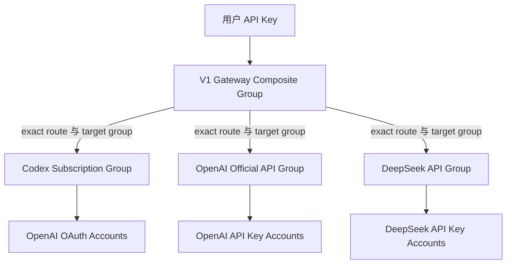

# Provider 与路由设计

## 1. 设计目标

V1 只开放 Codex Subscription、OpenAI Official API 和 DeepSeek Official API。三个 Provider 拥有独立目标 Group、账号池、启停、健康、价格和错误域。一个 Provider 的故障不得影响另外两个 Provider。

模型到 Provider 的决策由数据库显式配置。禁止根据模型前缀自动跨 Provider，禁止在目标 Group 不可用时落入另一个成本池。

## 2. 当前 Sub2API 事实

1. 平台常量包含 `openai` 与 `deepseek`，见 `backend/internal/domain/constants.go`。
2. Account 类型支持 OAuth 与 API Key，credentials 存放平台特定字段，见 `backend/ent/schema/account.go`。
3. Group 绑定 Account 并提供 priority、rate、model routing 和 fallback，见 `backend/ent/schema/group.go` 与 `account_group.go`。
4. OpenAI Scheduler 支持 previous response、Sticky、优先级、负载、并发、能力过滤和账号状态，见 `backend/internal/service/openai_account_scheduler.go`。
5. Composite Route 支持 exact、prefix、endpoint、target platform、upstream model、priority 和 enabled，见 `backend/ent/schema/composite_model_route.go`。
6. 迁移 `227_composite_routes_add_cn_providers.sql` 已允许 Composite Route 选择 DeepSeek。
7. Composite Route 当前不能指定 target Group。同属 `openai` 的 OAuth 和 API Key 账号池可能混合。
8. Group fallback 字段可以跨 Group，V1 必须为空。

## 3. Group 拓扑



V1 Gateway Group 设置：

* `platform=composite`
* `subscription_type=standard`
* `composite_explicit_routes_only=true`
* 用户 Key 只绑定该 Group
* Group 自身不直接承载上游账号

三个目标 Group 设置：

* `fallback_group_id=NULL`
* `fallback_group_id_on_invalid_request=NULL`
* 只包含本 Provider 合法账号
* 不直接向普通用户暴露为可绑定 Group

## 4. 路由规则

扩展 `composite_model_routes` 增加 `target_group_id`。解析后产生：

```text
access_group_id
route_id
provider
target_platform
target_group_id
logical_model
upstream_model
endpoint
```

V1 只创建 exact route。Route 必须启用，用户必须被授权，目标 Group 必须启用，价格版本必须有效。

同一 V1 access Group、逻辑模型和 endpoint 在数据库中最多只能有一条启用的 exact route。已被 `user_model_permissions` 引用的 Route 不得原地修改 public model、Provider、target Group、upstream model 或 endpoint；这些变化必须新建 Route、重新授权并停用旧 Route。这样权限不会在管理员改路由后静默扩大。

建议初始配置：

| 逻辑模型 | Endpoint | Provider | 目标 Group | 实际模型 | 状态 |
| --- | --- | --- | --- | --- | --- |
| Codex 模型名 | `responses` | `codex_subscription` | Codex Subscription Group | 待 M3 实测 | 待验证 |
| OpenAI 官方模型名 | `responses` 或 `chat_completions` | `openai_official` | OpenAI Official API Group | 管理员配置 | 待验证 |
| `deepseek-chat` | `chat_completions` | `deepseek_official` | DeepSeek API Group | V4 模型与 thinking profile 待确认 | blocked |
| `deepseek-reasoner` | `chat_completions` | `deepseek_official` | DeepSeek API Group | V4 模型与 thinking profile 待确认 | blocked |

DeepSeek 官方已在 2026 年 7 月 24 日停用两个旧模型名。可以把它们保留为 Gateway 逻辑别名，但实际模型和 thinking 参数必须由管理员明确配置并通过 M5 测试。

## 5. Codex Subscription Provider

### 5.1 复用能力

优先复用：

1. OpenAI OAuth 与 token refresh。
2. Codex Responses endpoints，包括 `/v1/responses` 和现有 Codex 兼容路径。
3. OpenAI Scheduler。
4. previous response affinity 与 Session Sticky。
5. 账号并发槽位、排队、Cooldown 和错误处理。
6. usage 解析与 Responses Streaming。

主要路径：

* `backend/internal/server/routes/gateway.go`
* `backend/internal/service/openai_account_scheduler.go`
* `backend/internal/service/openai_sticky_compat.go`
* `backend/internal/service/openai_codex_*`
* `backend/internal/repository/gateway_cache.go`

### 5.2 账号准入

Codex Subscription Group 只允许：

* `platform=openai`
* `type=oauth` 或经源码确认的 Codex Setup Token 类型
* 授权范围合法且有明确负责人
* Token 可刷新
* 未过期、未禁用、可调度

OpenAI API Key Account 禁止加入该 Group。

### 5.3 必测能力

1. Codex CLI 浏览器登录或 Gateway API Key 配置方式。
2. Responses 普通与 Streaming。
3. Reasoning effort。
4. Function 与 Tool Calls，多轮 continuation。
5. 长任务和客户端断线。
6. 模型列表与客户端自动探测。
7. `previous_response_id`。
8. 会话请求头和 Sticky Account。
9. OAuth 401 刷新与失败降级。
10. 多账号并发、优先级和恢复。

### 5.4 合规阻塞

官方个人服务条款禁止共享账号凭据或向他人提供账号访问。当前 OpenAI Services Agreement 也限制分享登录凭据、转售账号访问和规避 Usage Limits。M3 可以做合法测试账号的技术验证，任何多用户试运行或收费前必须完成人工法律与上游授权确认。

## 6. OpenAI Official API Provider

### 6.1 账号模型

OpenAI Official API Group 只允许：

* `platform=openai`
* `type=apikey`
* 官方 API Base URL 或经人工批准的企业 endpoint
* 加密保存的 API Key

支持多个 Key，每个账号设置独立 priority、concurrency、status、模型能力和健康信息。

### 6.2 模型与协议

每个公开模型建立 exact route。Endpoint 必须与实际模型能力一致。Responses 与 Chat Completions 分开配置，避免客户端调用错误协议后触发隐式转换。

允许使用现有模型 mapping 把逻辑名转成当前官方实际名。模型更新通过 Admin route 版本化完成。

### 6.3 健康策略

* 401：立即标记凭据错误，账号退出调度，要求人工轮换。
* 429：读取 Retry After 或 reset header，进入临时 Cooldown。
* 403：按错误类型决定凭据错误或配额限制。
* 5xx 与 Timeout：短暂退避，在同一 Group 内选择其他账号。
* 成功探测或冷却到期：按现有 Scheduler 恢复。

健康检查使用最小成本请求或官方无费用 endpoint，具体方式待 M4 实测。禁止高频健康检查产生可观成本。

## 7. DeepSeek Official API Provider

### 7.1 当前已有能力

1. `PlatformDeepseek` 已存在。
2. 使用 OpenAI Compatible Chat Completions 转发路径。
3. 源码测试覆盖 reasoning content 的普通和 Streaming 透传，见 `backend/internal/service/openai_gateway_chat_completions_raw_test.go`。
4. 余额探测调用 `/user/balance`，见 `backend/internal/service/cn_provider_balance_service.go`。
5. 默认模型列表当前为 `deepseek-v4-pro` 与 `deepseek-v4-flash`，见 `backend/internal/handler/gateway_handler.go`。
6. Billing fallback 也已出现 V4 模型与旧名退役说明。

### 7.2 目标配置

DeepSeek API Group 只允许 `platform=deepseek` 和 `type=apikey`。Base URL 默认 `https://api.deepseek.com`，必须经过 URL allowlist，禁止把 Key 发送到未批准 Host。

对外模型名有两种方案：

1. 推荐：直接发布当前 V4 模型名，客户端显式配置 thinking。
2. 兼容：保留 `deepseek-chat` 与 `deepseek-reasoner` 逻辑别名，Route 映射 V4 实际模型，并为 reasoner 应用受控 thinking profile。

需求当前指定第二种方案，官方接口变化使它进入人工确认。未经确认不得把旧名直接发送到上游。

### 7.3 必测能力

1. `/v1/models` 当前实际返回。
2. 普通 Chat Completions。
3. SSE Streaming 和最终 usage。
4. `reasoning_content` 多轮回传。
5. Tool Calls 与 thinking 组合。
6. context length、Timeout 和长输出。
7. 401、402、429、5xx 错误。
8. `/user/balance` 双币种响应。
9. 价格与上游 usage 抽样对账。

## 8. 账号状态映射

用户需求中的展示状态不改变底层状态机：

| UI 状态 | 现有信号 |
| --- | --- |
| Active | status active、schedulable true、无有效 cooldown |
| Cooldown | rate limited、overload、temporary unschedulable 或 reset time 尚未到 |
| Exhausted | 余额或配额探测显示不可用，或账号被配额策略暂停 |
| Disabled | status disabled、凭据错误后人工停用或删除 |

映射函数放在 Admin DTO 或独立 presenter，Scheduler 继续读取现有字段。

## 9. Sticky Session

Codex 请求按现有优先级使用 previous response 和会话锚点。Redis 保存 session 到 account 绑定，TTL 沿用并经 M3 实测调整。

规则：

1. Sticky 只在同一 `target_group_id` 内有效。
2. 缓存绑定账号必须重新通过 status、模型能力和并发检查。
3. 账号失效时允许在同一目标 Group 内重新选择并更新绑定。
4. 禁止沿用另一个 Group 的绑定。
5. 路由或模型变化时 session cache key 必须包含 target Group 与模型域。

Nginx 保持请求头、SSE 和 WebSocket。`X-Session-Id`、`X-Claude-Code-Session-Id` 与实际 Codex header 需要抓取脱敏测试证据。

## 10. Failover 规则

允许：

* 同一 target Group 内从异常账号切换到另一个同类账号。
* Sticky 账号失效后在同一 Group 重选。
* 相同 Provider、相同成本类别中的受控重试。

禁止：

* Codex Subscription 自动切到 OpenAI Official API。
* OpenAI Official API 自动切到 Subscription。
* DeepSeek 自动切到 OpenAI。
* 未匹配模型依赖 Composite 内置前缀检测。
* `fallback_group_id` 自动跳组。

未来若需要跨 Provider，必须创建显式 route policy，包含成本上限、授权范围、审计和用户可见提示，并单独立项。

## 11. Provider Health

每个 Group 汇总：

* total accounts
* active accounts
* cooldown accounts
* exhausted accounts
* disabled accounts
* concurrency used 与 capacity
* 最近五分钟请求、错误率、429、401、5xx
* 最近成功时间和最近错误
* 上游余额或 quota snapshot，只有 Admin 可见

严重告警：

1. Group 无可用账号。
2. 五分钟错误率超过 20%，且请求数至少 10。
3. 任一 401 凭据错误。
4. 所有账号进入 Cooldown 或 Exhausted。
5. usage 缺失或结算失败。

## 12. Provider 关闭验收

对每个 Provider 重复以下测试：

1. 停用目标 Group。
2. 该 Provider 模型返回 503 和稳定 code。
3. 另外两个 Provider 的模型正常响应。
4. 没有跨 Group account selection。
5. 没有产生意外上游费用。
6. Dashboard 只标记对应 Provider 异常。

## 13. 待确认

1. Codex Subscription 多用户使用的授权与合规边界。
2. M3 具体公开模型名与 Codex CLI 当前协议。
3. DeepSeek 旧逻辑别名是否保留，以及 reasoner 映射到哪个 V4 模型和 thinking 参数。
4. OpenAI Official V1 开放哪些模型与 endpoint。
5. 目标 Group 路由对现有 Billing、Ops 和 model list 投影的完整影响。
