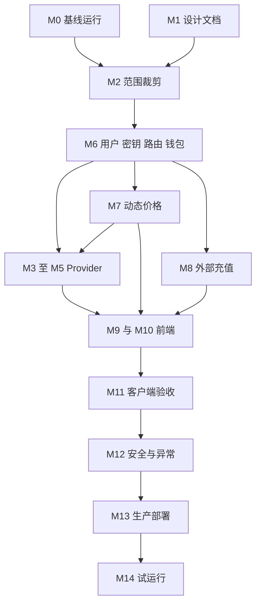

# 项目实施计划

## 1. 总体目标

在尽量保留 Sub2API 上游结构的前提下，交付一个供 10 到 50 名可信用户使用的 AI API Gateway。V1 支持 Codex CLI、Cursor 和 OpenAI Compatible 客户端，提供三类独立 Provider、用户隔离、显式模型路由、人民币预付余额、实际用量结算、动态价格、价格历史、安全外部充值接口和可恢复部署。

## 2. 当前目标

M0 固定基线、可重复本地运行和验收证据已完成。当前阶段进入 M2，只关闭公开与商业功能并补齐前后端关闭守卫；不接入任何真实 Provider 凭据，也不提前实施 M6 之后的 schema。

基线：

* Upstream：`https://github.com/Wei-Shaw/sub2api.git`
* 分支：`main`
* Commit：`b1748c4ea99ce2120401a269142aa071e18a84da`
* Commit 时间：`2026-09-03T15:40:51+08:00`
* 当前最新发布标签：`v0.2.0`

## 3. 状态定义

| 状态 | 含义 |
| --- | --- |
| `pending` | 尚未开始 |
| `in_progress` | 正在执行，尚未验收 |
| `blocked` | 存在明确阻塞，见 `findings.md` |
| `completed` | 所有完成条件和测试均已通过 |

每次只能有一个 Milestone 处于 `in_progress`。子任务可以保留 `pending` 或 `blocked`。

## 4. 里程碑总览

| Milestone | 目标 | 当前状态 | 主要依赖 |
| --- | --- | --- | --- |
| M0 | 准备 Fork 并运行原始系统 | `completed` | 已于 2026-09-12 验收 |
| M1 | 源码分析与设计文档 | `completed` | 当前源码基线 |
| M2 | 关闭公开与商业功能 | `in_progress` | M0，M1 |
| M3 | Codex Subscription 验证 | `pending` | M2，M6，M7，合规人工确认 |
| M4 | OpenAI Official API | `pending` | M2，M6，M7 基础接口 |
| M5 | DeepSeek Official API | `pending` | M2，M6，M7，模型名人工确认 |
| M6 | 用户、密钥、路由与钱包基础 | `pending` | M2，数据库方案确认 |
| M7 | 动态价格与历史快照 | `pending` | M6 |
| M8 | Internal Recharge API | `pending` | M6，安全密钥方案 |
| M9 | 管理后台精简 | `pending` | M3 到 M8 |
| M10 | 用户后台精简 | `pending` | M6，M7，M9 |
| M11 | Codex 与 Cursor 兼容验收 | `pending` | M3 到 M5，M10 |
| M12 | 安全、并发与异常测试 | `pending` | M6 到 M11 |
| M13 | Linux 生产部署 | `pending` | M12 |
| M14 | 小范围试运行 | `pending` | M13，合规放行 |

M1 文档已基于静态源码分析完成。Windows Docker Desktop 已解除 M0 的工具链阻塞，固定基线的镜像、全栈健康检查、后端与前端测试已通过。正式 Fork `https://github.com/lanora-tree/sub2api` 已创建并配置为 `origin`。管理员本人已完成上游合规声明，M0 测试 Group、User、Key、模拟 Gateway、Streaming 首包与用量落库均已验收；临时模拟上游已移除，测试账号保留为 inactive。

正式执行顺序不是按 Milestone 编号机械递增。基线通过后的主路径为 `M2 -> M6 -> M7 -> M3/M4/M5`；M8 可在 M6 后与 M7 并行设计，但必须在 M12 前验收。M3 到 M5 在 M6、M7 前只允许使用 mock 或专用低额度账号做不收费的技术探测，不得标记 Provider Milestone 完成。

## 5. M0 准备源码与基线运行

任务：

1. 创建 Fork，配置 `origin` 与 `upstream`。
2. 固定发布 tag 或审计 commit，记录镜像 digest。
3. Windows Docker Desktop 启动 PostgreSQL、Redis、Backend、Frontend。
4. 完成初始化，确认 Admin、登录、Gateway、健康检查。
5. 创建无真实业务数据的测试账号、测试 Group 和测试 Key。
6. 运行后端、前端和部署基线测试，保存结果。
7. 记录 CPU、内存、首包延迟和 Streaming 基线。

完成条件：

* 四个核心组件健康。
* `/health`、Admin UI、用户登录和一条模拟 Gateway 请求可用。
* 原始代码测试通过，已知失败有可复现记录。
* `progress.md` 保存版本、命令和基线结果。

## 6. M1 源码分析与设计文档

任务：

1. 审计 backend、frontend、Gateway、Provider、OAuth、计费、调度、Redis、PostgreSQL、Ent、迁移、支付、权限、Compose 与测试。
2. 对照需求记录已有能力、缺口、冲突和风险。
3. 生成 14 份交付文档并执行交叉检查。

完成条件：

* 14 份文档齐全。
* 关键结论包含源码路径。
* 不确定项有明确标记。
* `findings.md` 顶部包含 Project Readiness Summary。
* 未修改 Sub2API 业务代码与数据库。

## 7. M2 关闭公开与商业功能

任务：

1. 设置 `registration_enabled=false`、`payment_enabled=false`、`promo_code_enabled=false`、`invitation_code_enabled=false`、`affiliate_enabled=false`。
2. 关闭所有第三方登录开关。
3. 关闭 Model Plaza、Available Channels、Plugin Management、公开监控与无关菜单。
4. 前端移除 V1 导航入口，保留源文件。
5. 对注册、支付、Webhook、兑换码和公开页面增加服务端关闭守卫。
6. 添加关闭状态 API 测试，确保直接请求也被拒绝。

完成条件：

* Admin 仍可创建 User。
* User 仍可登录和使用 Gateway。
* 所有关闭功能的 UI 入口消失，直接调用返回稳定的 404 或功能关闭错误。
* 现有实现未删除，可通过受控开关恢复。

## 8. M3 Codex Subscription Provider

任务：

1. 人工确认 OpenAI 条款、账号授权范围和内部使用边界。
2. 创建 Codex Subscription Group，仅加入合法授权的 OpenAI OAuth 账号。
3. 验证 OAuth 登录、刷新、失效、账号禁用和恢复。
4. 使用 M6 已完成的 `target_group_id`、`explicit_routes_only` 和唯一约束配置 Codex 路由，不在本 Milestone 新建共享路由基础设施。
5. 验证 Responses、Streaming、Reasoning、Tool Calls、长请求、模型列表、previous response 和 Sticky Session。
6. 验证多账号优先级、并发、Cooldown 和 Exhausted 映射。
7. 验证 Nginx 对 SSE、WebSocket、超时和 Session 请求头的处理。
8. 接入数据库价格版本和 usage 价格快照。

完成条件：

* Codex CLI 完整用例通过。
* 同一会话在有效账号上保持 Sticky。
* 账号异常时只在该 Group 内恢复或切换。
* 禁止落入 OpenAI Official API Group。
* 实际 usage 与账单记录一致。

## 9. M4 OpenAI Official API Provider

任务：

1. 创建 OpenAI Official API Group，添加多个 API Key 账号。
2. 实施上游账号凭据加密和脱敏。
3. 配置显式模型路由、用户权限和价格版本。
4. 验证 Chat Completions、Responses、Streaming、usage、模型映射、健康检查和错误统计。
5. 验证 401、429、5xx、Timeout、Key 轮换和账号禁用。

完成条件：

* OpenAI SDK 用例通过。
* API Key 不出现在列表响应、日志或数据库明文字段。
* 路由只进入 Official API Group。
* 关闭该 Group 不影响另外两个 Provider。

## 10. M5 DeepSeek Official API Provider

任务：

1. 人工确认 V1 对外模型名。官方已于 2026 年 7 月 24 日停用 `deepseek-chat` 与 `deepseek-reasoner`。
2. 创建 DeepSeek API Group，配置官方 Base URL 与加密 API Key。
3. 如保留旧逻辑名，明确映射到 V4 模型并验证 thinking 请求参数。
4. 验证 Chat Completions、Streaming、reasoning content、Tool Calls、usage、余额查询和错误映射。
5. 配置 CNY 价格版本，完成账单校验。

完成条件：

* 经确认的两个公开逻辑模型可用。
* 官方实际模型名、thinking 行为和价格已记录。
* 余额探测失败不泄漏 Key，也不影响其他 Provider。
* 路由只进入 DeepSeek API Group。

## 11. M6 用户、密钥、路由与钱包基础

任务：

1. 明确全站记账币种 CNY，完成空库或存量数据迁移方案。
2. 保留 `users.balance` 为权威余额，新增 `wallet_transactions` 作为不可变流水。
3. 将新增金额热路径改为 Decimal。
4. 完成管理员充值、退款、调账和用户余额查询。
5. 增加 `user_model_permissions`，请求前执行用户与模型授权。
6. API Key 改为 HMAC 摘要存储并只展示一次。
7. 上游账号凭据迁移到独立密钥加密存储。
8. 建立账本对账任务和异常告警。
9. 为 Composite Route 增加 `target_group_id` 和 `composite_explicit_routes_only`，并实现 V1 exact route 唯一约束、权限引用后的语义不可变规则和缓存失效。

完成条件：

* 并发更新无丢失。
* 一条业务事件对应一条唯一流水。
* 用户只读自己的余额、Key 和 usage。
* 旧明文 Key 和账号 Secret 清除并完成轮换。
* 同一 V1 逻辑模型和 endpoint 只命中一个启用的目标 Group，已授权 Route 不能原地改变授权语义。

## 12. M7 动态价格系统

任务：

1. 新增 `model_pricing_rules` 和不可变 `model_pricing_versions`。
2. 后台支持创建、启停、调价、备注和历史查看。
3. 价格解析绑定 Provider、目标 Group、逻辑模型、协议和生效时间。
4. usage 保存价格版本和快照。
5. 禁止无价格请求，移除 V1 收费路径的硬编码兜底。
6. 验证调价前后账单不回算。

完成条件：

* 所有开放模型均有唯一有效价格。
* 历史账单在调价后保持不变。
* 价格修改有管理员审计记录。

## 13. M8 Internal Recharge API

任务：

1. 实现 `POST /api/v1/internal/wallet/recharges`。
2. 实现 HMAC SHA256、Key ID、五分钟时间窗、Nonce、防重放、IP Allowlist 和限流。
3. 新增 `external_recharge_orders`，以 `(source, external_order_id)` 唯一。
4. 同一事务完成订单、余额和流水。
5. 实现相同请求重放和冲突请求错误。
6. 增加密钥轮换、审计和故障测试。

完成条件：

* 重试不会重复充值。
* 同订单不同金额返回 409。
* 签名错误、过期、Nonce 重放和非白名单 IP 均被拒绝。
* 响应和日志不包含 HMAC Secret。

## 14. M9 管理后台精简

任务：

1. 提供精简 Dashboard。
2. 完成用户、Key、上游账号、Group 路由、模型价格、用量和系统设置页面。
3. 所有金额显示人民币，所有 Secret 脱敏。
4. 保留 upstream 页面文件，以功能策略控制可见性。

完成条件：

* Admin 可完成 V1 全部运营任务。
* 隐藏页面无法通过直接路由绕过后端授权。

## 15. M10 普通用户后台精简

任务：

1. 只展示余额、今日与本月消费、自己的 Key、日志、模型和接入指南。
2. 创建 Key 时只展示一次并要求用户确认保存。
3. 提供 Codex 与 Cursor 可复制配置，示例只使用占位符。
4. 验证所有查询强制绑定当前 User ID。

完成条件：

* 两个用户互相无法读取或推断数据。
* 页面和接口无上游 Secret、账号信息和内部成本。

## 16. M11 客户端兼容验收

任务：

1. 使用当前稳定版 Codex CLI 执行完整会话。
2. 使用当前稳定版 Cursor 测试模型列表、Chat Completions、Streaming、长上下文、Reasoning 和错误返回。
3. 使用官方 OpenAI SDK 测试 Responses 与 Chat Completions。
4. 保存客户端版本、请求矩阵、结果和已知限制。

完成条件：

* 三类客户端核心用例通过。
* 所有协议差异有文档和回归测试。

## 17. M12 安全、并发与异常测试

任务：

1. 执行用户隔离、权限绕过、Secret 扫描、HMAC、防重放和日志隐私测试。
2. 执行同用户、跨用户、同账号、多账号和余额并发测试。
3. 模拟 Provider 401、429、5xx、Timeout、断流、OAuth 失效和额度耗尽。
4. 模拟 Redis、Backend 和 PostgreSQL 重启。
5. 验证结算失败时持久化恢复日志、fsync、重启保持 degraded、幂等重放与人工解除路径。

完成条件：

* 无高危安全问题。
* 账本对账差异为零。
* 故障恢复时间和人工步骤已记录，损坏恢复记录不会被静默跳过。

## 18. M13 生产部署

任务：

1. 固定镜像 tag 与 digest，准备 Linux Compose。
2. 配置 Nginx、HTTPS、Firewall、数据卷、日志轮转和 Healthcheck。
3. 部署 PostgreSQL 基础备份、连续 WAL 归档和 PITR，保留每日逻辑备份，并完成一次隔离恢复演练。
4. 仅开放 80、443 和受限 SSH 管理端口。
5. 为结算恢复日志配置独立持久卷、加密密钥、可写探针和快照或复制策略。
6. 执行生产验收和回滚演练。

完成条件：

* PostgreSQL、Redis 和 Backend 内部端口无公网暴露。
* 重启后数据完整。
* HTTPS、Streaming、WebSocket 和长请求通过。
* PITR 恢复点满足经批准的 RPO，备份可恢复，账本与 usage 对账为零差异。

## 19. M14 小范围试运行

任务：

1. 先开放 3 到 5 名用户，再分批提升到 10 到 50 人。
2. 每日核对请求量、错误率、余额、流水、Provider 消费和账号稳定性。
3. 每周演练一个 Provider 停用和一笔账单对账。
4. 达到退出条件时暂停新增用户并回滚。

完成条件：

* 连续两周无高危账务或安全事件。
* 账本对账差异为零。
* Provider 错误率、延迟和容量处于设定阈值内。
* 人工确认是否进入正式长期运行。

## 20. 关键依赖关系

## 21. 当前阻塞与人工确认

1. M0 管理端 `v2026.06.10` 合规确认已由管理员本人完成，门禁阻塞关闭。
2. Codex Subscription 账号池涉及账号共享与转售限制，M3 前必须获得单独的业务与法律确认。
3. Sub2API `LICENSE` 为 LGPL 3.0 或更高版本，README_CN 同时写有“无商业授权”声明，分发或收费前需要法律审核。
4. DeepSeek 已停用两个需求中的旧模型名，需要确认继续保留逻辑别名，或直接改用 V4 公共模型名。
5. CNY 作为全站权威记账币种，以及现有 USD 语义字段的迁移策略，需要产品负责人确认。
